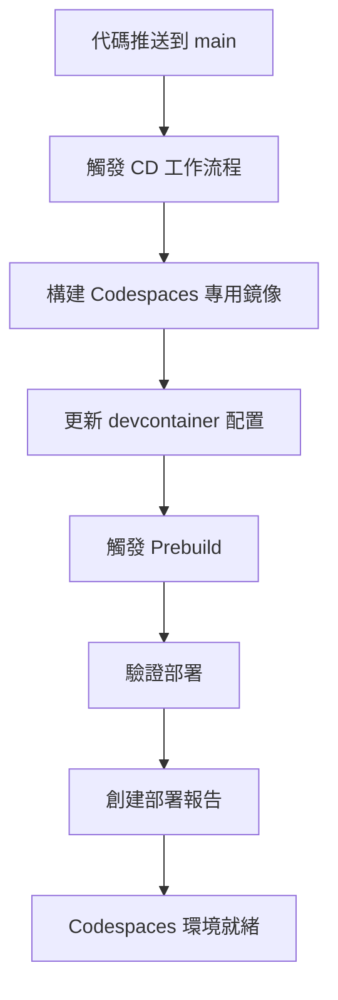

# 🚀 GitHub Codespaces 自動部署指南

## 🎯 概覽

本項目配置了完整的 CI/CD 流程，可以自動將 FastAPI 應用部署到 GitHub Codespaces，提供即開即用的雲端開發環境。

## 🏗️ 部署架構



## 🔄 自動部署流程

### 1. 觸發條件

自動部署會在以下情況觸發：

-   **代碼推送**: 推送到 `main` 或 `master` 分支
-   **文件變更**: 以下文件發生變更時
    -   `src/**` - 源代碼變更
    -   `requirements/**` - 依賴變更
    -   `Dockerfile` - Docker 配置變更
    -   `docker/**` - Docker Compose 配置變更
    -   `.devcontainer/**` - Codespaces 配置變更
-   **手動觸發**: 通過 GitHub Actions 手動觸發

### 2. 部署步驟

#### 步驟 1: 構建 Codespaces 專用鏡像

```yaml
# 構建優化的開發環境鏡像
- 基於 python:3.11-slim
- 安裝開發工具 (Just, Git, Zsh)
- 預安裝 Python 依賴
- 配置 Codespaces 特定設置
```

#### 步驟 2: 更新配置文件

```yaml
# 自動更新 devcontainer 配置
- 更新鏡像引用
- 生成部署信息
- 配置端口轉發
- 設置啟動命令
```

#### 步驟 3: 觸發預構建

```yaml
# 優化 Codespaces 啟動速度
- 預安裝擴展
- 預編譯依賴
- 緩存常用資源
```

#### 步驟 4: 驗證部署

```yaml
# 確保部署成功
- 測試鏡像啟動
- 驗證 Python 環境
- 檢查應用導入
- 生成部署報告
```

## 🛠️ 配置文件說明

### `.github/workflows/cd-codespaces.yml`

主要的 CD 工作流程文件，包含：

-   鏡像構建和推送
-   配置文件更新
-   預構建觸發
-   部署驗證

### `.devcontainer/devcontainer.prebuild.json`

Codespaces 預構建配置：

-   優化的容器配置
-   預安裝的擴展
-   自動化設置命令

### `Dockerfile` (Codespaces 優化)

支持 Codespaces 的多階段構建：

```dockerfile
ARG CODESPACES=false
ARG INSTALL_DEV_TOOLS=false
ARG PREBUILD=false
```

## 🚀 使用方式

### 1. 創建 Codespace

1. 前往 GitHub 倉庫頁面
2. 點擊綠色的 "Code" 按鈕
3. 選擇 "Codespaces" 標籤
4. 點擊 "Create codespace on main"

### 2. 自動環境設置

Codespace 創建後會自動執行：

```bash
# 自動運行的設置命令
just codespaces-setup
```

### 3. 開始開發

```bash
# 檢查環境狀態
just codespaces-status

# 啟動開發服務器
just dev

# 運行測試
just test-unit

# 查看 API 文檔
# 訪問: https://your-codespace-8000.app.github.dev/docs
```

## 🔧 高級配置

### 手動觸發預構建

在 commit 消息中包含 `[prebuild]` 標籤：

```bash
git commit -m "更新依賴 [prebuild]"
```

### 強制重建

通過 GitHub Actions 手動觸發：

1. 前往 Actions 標籤
2. 選擇 "CD - Deploy to GitHub Codespaces"
3. 點擊 "Run workflow"
4. 勾選 "Force rebuild of Codespaces prebuilds"

### 自定義配置

編輯 `.devcontainer/devcontainer.json` 來自定義：

-   VS Code 擴展
-   端口轉發
-   環境變數
-   啟動命令

## 📊 監控和故障排除

### 部署狀態檢查

1. **GitHub Actions**: 查看工作流程執行狀態
2. **部署報告**: 每次部署後自動生成的摘要
3. **Codespace 日誌**: 在 Codespace 中查看設置日誌

### 常見問題

#### 問題 1: Codespace 啟動緩慢

**解決方案**:

-   確保預構建已啟用
-   檢查 `.devcontainer/devcontainer.prebuild.json` 配置
-   手動觸發預構建

#### 問題 2: 依賴安裝失敗

**解決方案**:

```bash
# 在 Codespace 中重新安裝
just codespaces-reset
```

#### 問題 3: 端口無法訪問

**解決方案**:

-   檢查端口轉發配置
-   確保應用綁定到 `0.0.0.0:8000`
-   查看 Codespace 端口標籤

### 調試命令

```bash
# 檢查環境狀態
just codespaces-status

# 查看部署信息
cat .devcontainer/DEPLOYMENT_INFO.md

# 重置環境
just codespaces-reset

# 查看日誌
tail -f logs/app.log
```

## 🔒 安全考慮

### 權限配置

-   使用 `GITHUB_TOKEN` 進行鏡像推送
-   限制工作流程權限範圍
-   不在日誌中暴露敏感信息

### 鏡像安全

-   定期更新基礎鏡像
-   使用最小權限原則
-   啟用容器掃描

## 📈 性能優化

### 預構建優化

-   預安裝常用依賴
-   緩存 Docker 層
-   優化鏡像大小

### 啟動速度優化

-   使用 `onCreateCommand` 預設置
-   延遲載入非必要組件
-   並行執行設置任務

## 🎯 最佳實踐

### 開發流程

1. 在本地開發和測試
2. 推送到 feature 分支
3. 創建 PR 觸發 CI
4. 合併到 main 觸發 CD
5. 在 Codespace 中驗證部署

### 配置管理

-   保持配置文件同步
-   使用環境變數管理差異
-   定期更新依賴版本

### 監控和維護

-   定期檢查部署狀態
-   監控資源使用情況
-   及時更新安全補丁

---

🎉 **恭喜！** 你現在擁有了一個完全自動化的 GitHub Codespaces 部署流程！
